# Name: Dhruv Patel
# StudentID: 9062297
# Assignment 3: Orchestration with Gitea

# Steps:

Clone the repo in my terminal: bash <(curl -s https://raw.githubusercontent.com/rhildred/bootstrap/main/oembootstrap)

configure cloudflared for my own tunnel: sudo su - ubuntu

To get a certificate from my cloudflare account: cloudflared tunnel login

Then create a tunnel: 
cloudflared tunnel create "Dhruvpatel-30"
sudo mkdir -p /etc/cloudflared

After create a /etc/cloudflared/config.yml config file:
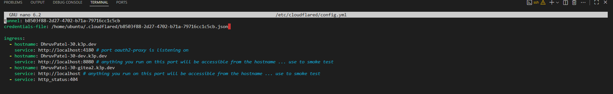

Then I create the dns entry on cloudflare: cloudflared tunnel route dns b8503f88-2d27-4702-b71a-79716cc1c5cb DhruvPatel-30.dev
 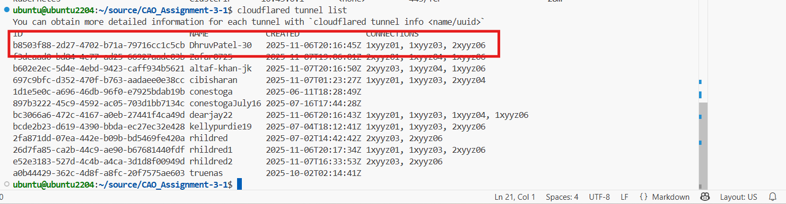

check status: sudo systemctl status cloudflared
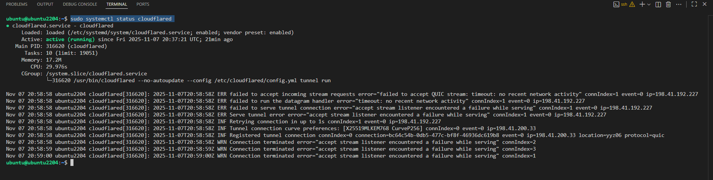

Now,

```bash
pip install ansible kubernetes
git submodule update --init --recursive
ansible-playbook up.yml
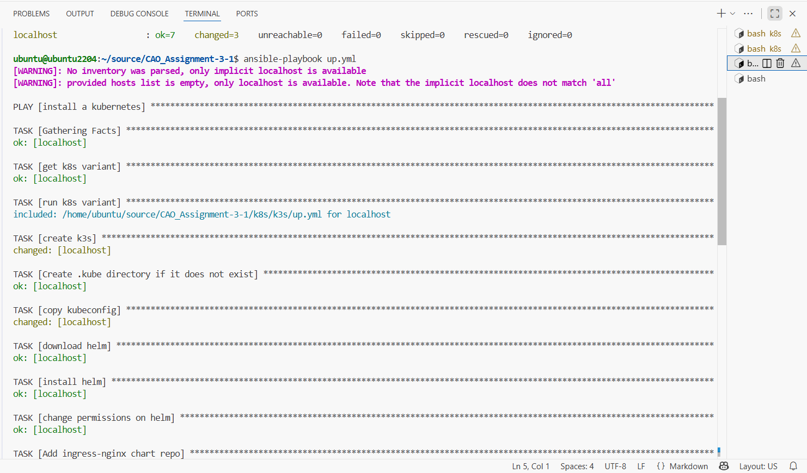
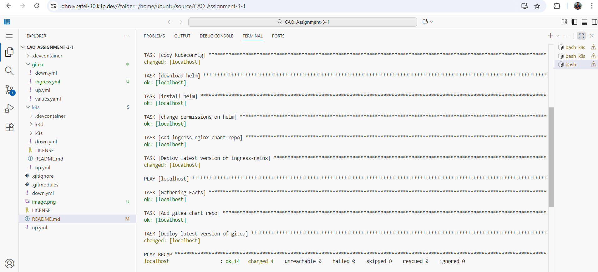
```

Wait until `kubectl get pod` shows all pods running
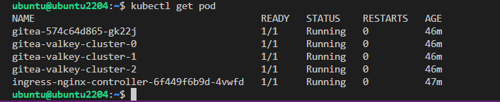

After,

```bash
kubectl port-forward svc/gitea-http 8080:3000
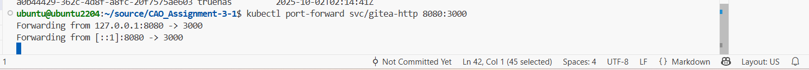

```
now create ingress and apply it:
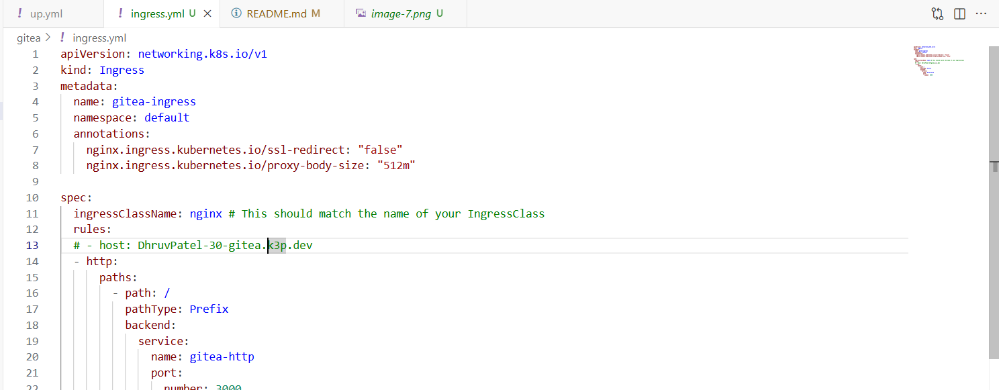


here is my ingress external:
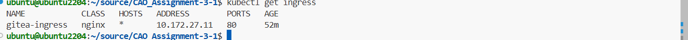

Now you should be able to access gitea in development mode.
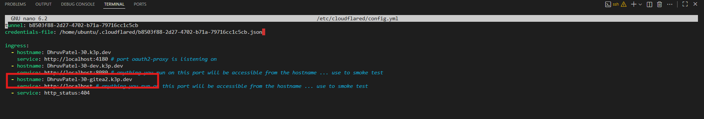
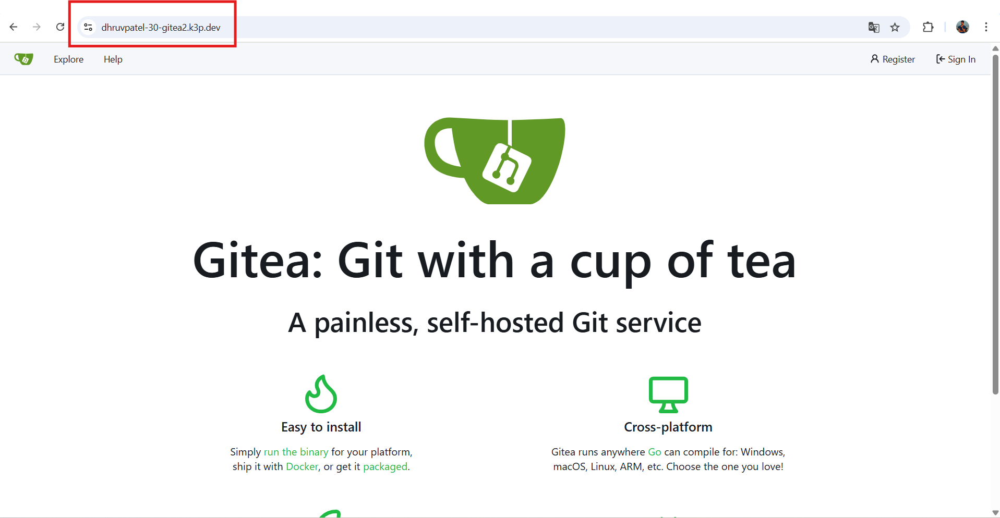

# Add database and use external database

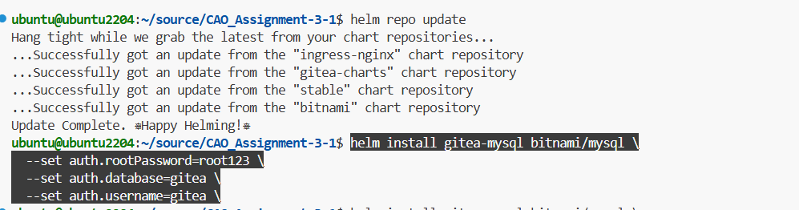

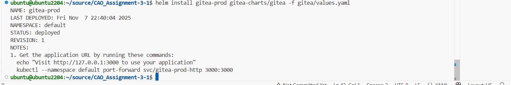

# Verify All

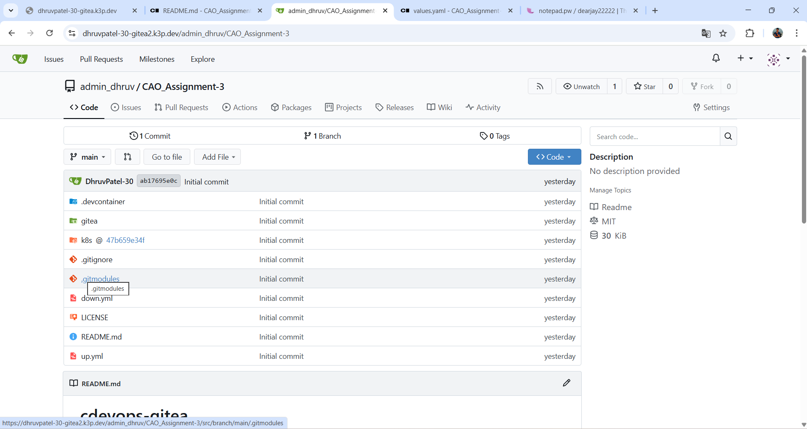

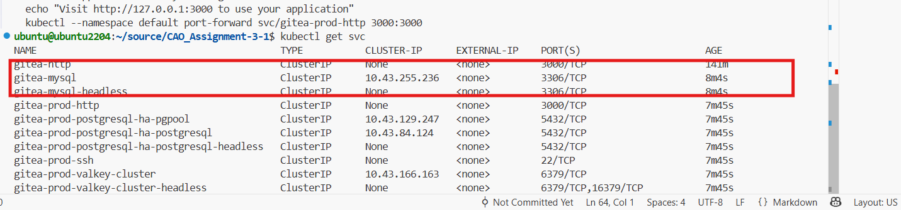

# Expose your gitea instance publically


